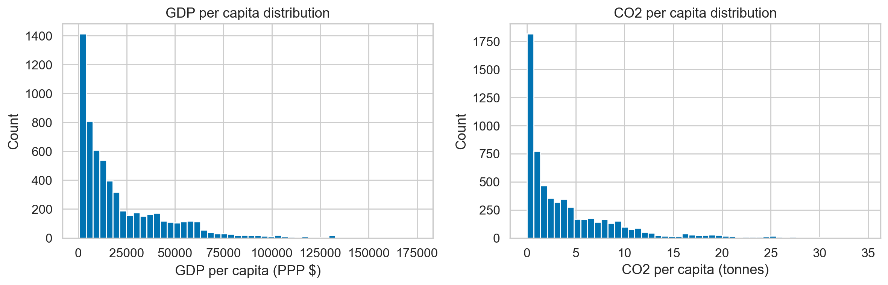
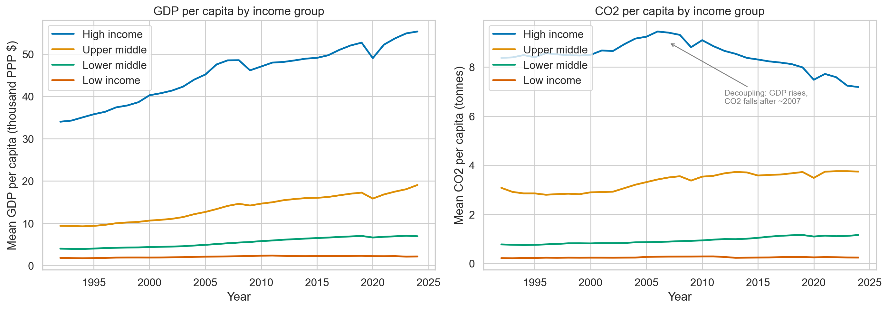
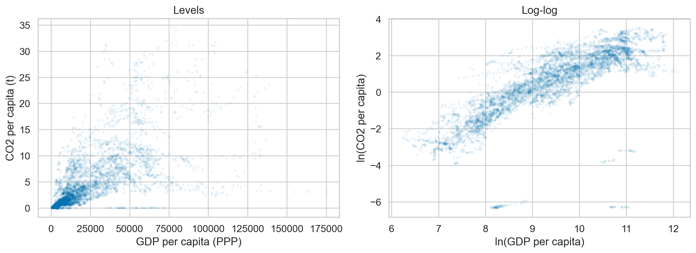

Name: Boga Petruska\
Class: ECBS5245 - Data Analysis 4: Causal Analysis (advanced)\
Assignment 2: Panel Data Exercise\
Date: March 26, 2026\
Github: [https://github.com/b0glarka/co2_emissions_gdp](https://github.com/b0glarka/co2_emissions_gdp)

# CO2 Emissions and GDP: A Panel Data Analysis

## 1. Introduction

This report examines the extent to which economic activity drives CO2 emissions, using country-level panel data from 1992 to 2024. CO2 emissions are arguably the most important channel through which human activity contributes to climate change. Both GDP and CO2 are flow variables measured annually at the country level, so they are well-suited for panel analysis.

## 2. Data

GDP per capita (PPP, constant 2021 international dollars) and total CO2 emissions (excluding LULUCF, Mt CO2e) are sourced from the World Bank's World Development Indicators. CO2 per capita is computed manually by dividing total emissions by population, as required by the assignment. Urbanization data (% urban population) and country income group classifications (high, upper-middle, lower-middle, low income) are sourced from the World Bank API.

| Series Code | Description | Unit |
|---|---|---|
| `NY.GDP.PCAP.PP.KD` | GDP per capita, PPP | Constant 2021 international $ |
| `SP.POP.TOTL` | Population, total | Persons |
| `EN.GHG.CO2.MT.CE.AR5` | CO2 emissions (total) excluding LULUCF | Mt CO2e |
| `SP.URB.TOTL.IN.ZS` | Urban population (% of total) | Percent |

LULUCF = Land Use, Land-Use Change and Forestry. Excluding LULUCF means only emissions from fossil fuels and industrial processes are counted.

Source: World Bank (2026). World Development Indicators. Retrieved March 19, 2026, from https://databank.worldbank.org/source/world-development-indicators

### 2.1 Descriptive Statistics

\input{output/tab1_descriptive.tex}

### 2.2 Coverage and Sample Selection

The World Bank dataset includes regional and income-group aggregates alongside real countries. We retain only entities with valid ISO 3166-1 alpha-3 codes, dropping 50 aggregates (e.g., "World," "Euro area," income classifications). We then exclude countries with fewer than 50% of years covered for both GDP and CO2, removing 25 countries primarily due to missing GDP data (e.g., Cuba, North Korea, Eritrea) or missing CO2 data (e.g., Serbia, Montenegro, Andorra). Palau was excluded due to implausibly high CO2 per capita values exceeding 200 tonnes. This value likely reflects international shipping or aviation emissions misattributed to this small island state. Regardless of the cause, Palau is excluded.

\input{output/tab2_coverage.tex}

The final panel contains 189 countries from 1992 to 2024. The 2024 cross-section has slightly fewer observations (178 vs 183 in 2005) due to reporting lags in the most recent year, but coverage remains strong.

### 2.3 Time Trends by Income Group

The time series reveal a highly distinct pattern: the GDP per capita of high-income countries has continued to rise steadily, even as their CO2 per capita peaked around 2007 and subsequently declined. Upper-middle-income countries show CO2 flattening after 2010. Lower-middle and low-income countries show modest increases in both variables. This visual evidence of decoupling in rich economies informs the panel regression analysis below.

## 3. Functional Form

Both GDP per capita and CO2 per capita are right-skewed and span several orders of magnitude. A log-log specification linearizes the relationship and yields coefficients interpretable as elasticities: a 1% change in GDP per capita is associated with a given % change in CO2 per capita.

## 4. Models

We estimate six models of increasing sophistication per the assignment: (1-2) cross-sectional OLS for 2005 and 2024, (3) first-difference with a time trend, (4-5) first-difference with 2 and 6 year lags of GDP growth, and (6) two-way fixed effects with country and year fixed effects. Cross-section models use heteroskedasticity-robust (HC1) standard errors; all panel models use standard errors clustered at the country level to account for within-country serial correlation.

\input{output/tab3_regressions.tex}

### 4.1 Interpretation

All models use log-log specification, so coefficients are elasticities.

**Models 1-2 (Cross-section OLS, 2005 and 2024):** The coefficient of 1.21 in 2005 means that countries with 1% higher GDP per capita have, on average, 1.21% higher CO2 per capita. By 2024 this drops to 1.06. This suggests that the cross-sectional association has weakened slightly over time. However, cross-section estimates likely suffer from omitted variable bias, which could include: unobserved country characteristics (geography, resource endowments, industrial structure) that correlate with both GDP and emissions.

**Model 3 (First difference, no lags):** First differencing removes time-invariant country characteristics. This is equivalent to including country fixed effects in the levels equation. The coefficient of ~0.47 means that a 1% increase in GDP growth is associated with a 0.47% increase in CO2 growth in the same year. This is much smaller than the cross-section estimates, and suggests that a large part of the cross-sectional relationship was driven by between-country differences rather than within-country changes. The time trend captures whether the annual rate of change in CO2 per capita is itself trending over time. Its small negative value suggests the pace of emissions growth is slowly declining. The low R-squared indicates that GDP growth alone is a weak predictor of annual emissions changes, though the relationship is statistically significant.

**Models 4-5 (First difference with lags):** Adding lags of GDP growth captures delayed effects on emissions growth. Economic growth often involves investment (construction, infrastructure) that counts toward GDP immediately but only generates emissions once completed and operational, creating a potential delay. Contemporaneous effect remains around 0.45-0.48. In model 4, the 1- and 2-year lags are small and insignificant. In model 5 with 6 lags, the L3 and L6 coefficients are marginally significant while L4 and L5 are not, a somewhat irregular pattern. A joint F-test confirms that the lags are not collectively significant (F=1.23, p=0.29), suggesting the effect is essentially contemporaneous.

**Model 6 (Two-way Fixed Effects):** This controls for all time-invariant country characteristics (country FEs) and all global time-varying shocks (year FEs, which flexibly capture what the linear time trend approximates in models 3-5). The coefficient of ~0.60 represents the within-country elasticity: when a country's GDP per capita grows by 1%, its CO2 per capita grows by about 0.60%. This is roughly half the cross-section estimate from Model 1, suggesting that much of the cross-country correlation reflects persistent country characteristics (e.g., oil-rich countries are both wealthy and high-emitting) rather than GDP growth directly causing higher emissions.

**Overall pattern:** Moving from cross-section OLS (Models 1-2: 1.06-1.21) to first difference (Models 3-5: 0.47-0.48) and two-way fixed effects (Model 6: 0.60), the estimated effect of a 1% increase in GDP per capita on CO2 per capita drops substantially. In all within-country specifications, a 1% increase in GDP leads to less than a 1% increase in emissions, suggesting that much of the cross-country correlation between GDP and CO2 reflects persistent country characteristics rather than a causal effect of economic growth on emissions.

**Caveats:** Reverse causality remains a concern, in that energy-intensive industries simultaneously generate GDP and CO2. In this scenario, the observed relationship may partly reflect industries that cause movement in both values, rather than GDP causing increased CO2 emissions.

### 4.2 Subsample Analysis

\input{output/tab4_subsample.tex}

The subsample analysis reveals a notable difference, whereby for high-income countries, a 1% increase in GDP is associated with only a 0.36% increase in CO2 (and only marginally significant), compared to 0.61% for non-high-income countries.  For high-income countries, the R-squared (within) value of 0.009 means GDP growth explains virtually none of the within-country CO2 variation in rich economies. This is consistent with the time series plot showing decoupling in high-income countries after approximately 2007. It suggests that the pooled estimate of 0.60 (and R-squared (within) value of 0.22) is a weighted average of a strong relationship in developing countries and a weak or absent one in rich countries.

## 5. Confounder: Urbanization

Urbanization (% of population in urban areas) is a potential confounder. This could be due to more urbanized countries tending to have higher GDP per capita through agglomeration economies, and higher CO2 per capita through concentrated energy demand and transport infrastructure. We add log urbanization to models 1, 4, and 6.

\input{output/tab5_confounder.tex}

**Cross-section (Model 1c):** The GDP coefficient drops slightly from 1.21 to 1.10, and urbanization is positive but insignificant (0.36, p > 0.1). In the cross-section, urbanization and GDP are highly correlated, making it hard to separate their effects.

**First difference (Model 4c):** The GDP growth coefficient barely changes (0.453 to 0.449), but the urbanization growth rate is large and significant (0.593, p < 0.01). In years when a country urbanizes faster, its CO2 emissions also grow faster, independent of GDP growth. This likely reflects the carbon-intensive infrastructure that accompanies urbanization: construction, expanded transport networks, and increased energy demand for buildings.

**TWFE (Model 6c):** The GDP coefficient drops from 0.60 to 0.54, and urbanization has a near-unit elasticity (0.982, p < 0.001). R-squared jumps from 0.222 to 0.272. Adding urbanization adds a modest improvement to the model's explanatory power and reduces the GDP coefficient from 0.60 to 0.54, indicating that part of the apparent GDP effect operates through urbanization.

**Why the urbanization effect differs across models:** In the TWFE model, a 1% increase in urbanization is associated with a 0.98% increase in CO2, compared to only 0.59% in the first-difference model. One possible explanation is that urbanization affects emissions through slow-moving channels such as infrastructure investment, housing construction, and transport network expansion, which all accumulate over years. First differencing captures only the immediate, within-year effect, while TWFE reflects the long-run relationship between urbanization and emissions levels.

**Causal interpretation caveat:** For urbanization to be a true confounder, it must independently cause both higher GDP and higher CO2. But urbanization may itself be a result of GDP growth. As countries get richer, people move to cities. If that is the case, the chain is GDP -> urbanization -> CO2. As a result, controlling for urbanization removes part of the real GDP effect. TWFE coefficient without urbanization (Model 6: 0.60) captures the full effect of GDP on CO2, including any part that works through urbanization. TWFE coefficient with urbanization (Model 6c: 0.54) captures only the direct effect. Together, this suggests that urbanization accounts for at most 10% of the GDP-CO2 relationship (the drop from 0.60 to 0.54), while the remaining 90% reflects direct effects of economic activity on emissions.

## 6. Summary

This analysis examines the relationship between GDP per capita and CO2 emissions per capita using a panel of 189 countries from 1992 to 2024. Using a log-log specification, cross-sectional OLS estimates suggest that a 1% increase in GDP is associated with a 1.1-1.2% increase in CO2. Moving to within-country variation through first-difference models reduces this to approximately 0.47%, and a two-way fixed effects model yields 0.60%. The effect of GDP growth on emissions is largely contemporaneous, with lagged effects jointly insignificant (F=1.23, p=0.29). Adding urbanization as a control reduces the TWFE estimate to 0.54%, though whether urbanization is a true confounder or a mediator on the causal pathway remains ambiguous.

The baseline TWFE estimate of 0.60 captures the total within-country effect of GDP on CO2, while the urbanization-controlled estimate of 0.54 captures the direct effect. We consider the range of 0.54-0.60 as our best estimate.

Subsample analysis reveals that this average masks substantial heterogeneity, however. For high-income countries, a 1% increase in GDP is associated with only a 0.36% increase in CO2 (R-squared (within) of 0.009), less than half the 0.61% for non-high-income countries (R-squared (within) of 0.38). For rich economies, GDP growth is effectively decoupled from emissions, as confirmed by the time series showing high-income CO2 per capita declining since approximately 2007 even as GDP continues to rise. In developing economies, the coupling remains strong.

An estimate in the range of 0.54-0.60 means that a 1% increase in GDP leads to roughly a 0.5-0.6% increase in emissions. This is less than proportional, but still positive. For global emissions to fall while the economy grows, this number would need to be negative, not merely below 1. A positive value, no matter how small, means that economic growth still adds to emissions. Only a negative value would mean the economy can grow while emissions actually decline. The subsample results suggest this is achievable, as high-income countries have already reached near-zero values of C02 emission increases. The policy challenge lies in accelerating this transition in developing economies, where a 1% increase in GDP still leads to a 0.6% increase in emissions and industrialization is ongoing.
